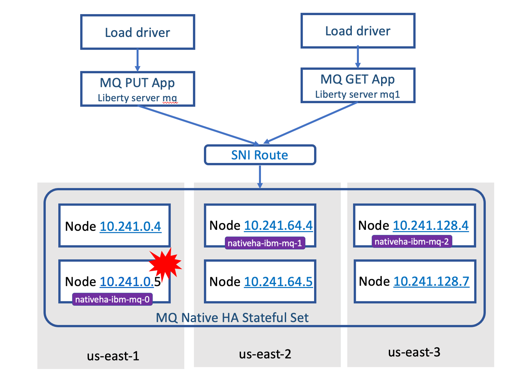
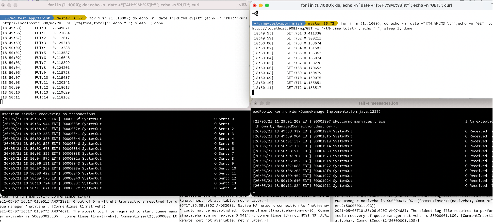

# mq-test-harness




## Load driver
Load driver is a shell running curl commands in a loop driving REST endpoints in the web app running in the Liberty server

E.g. the load driver generating PUT messages :

```
for i in {1..1000}; do echo -n `date +"[%H:%M:%S]\t"`;echo -n 'PUT:';curl http://localhost:9080/mq/PUT -w '\t%{time_total}'; echo " "; sleep 1; done
```
and the load driver generating GET messages :

```
for i in {1..1000}; do echo -n `date +"[%H:%M:%S]\t"`;echo -n 'GET:';curl http://localhost:9081/mq/GET -w '\t%{time_total}'; echo " "; sleep 1; done
```

Using 2 instances of Liberty with same app deployed is not necessary, but separate GET and PUT logs is easier to monitor.

## Liberty server
The template for WebShere Liberty instance is under main/liberty
The app needs to be configured with TLS, hence jvm.options is used to point to keystore files with certs. It has hardcoded full path to jks files and needs to be edited

## Sample run



